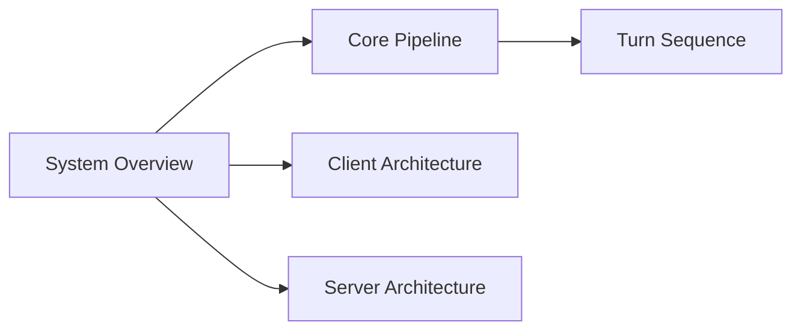
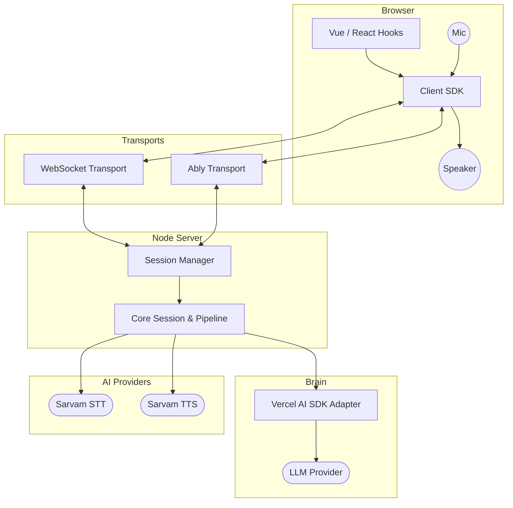
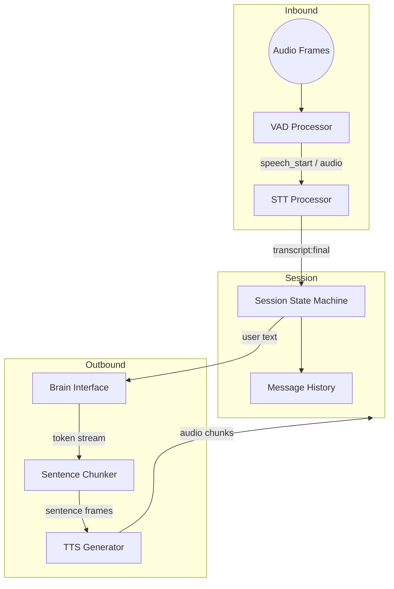
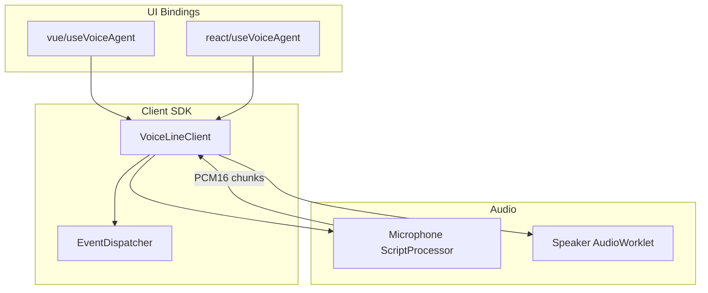
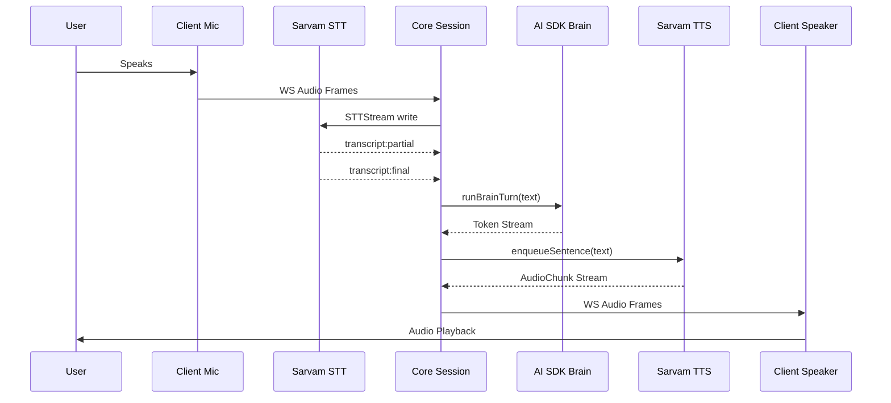

# voice-line

## Navigation

<!-- diagram:overview:system -->
## System Overview

<!-- diagram:component:core -->
## Core Pipeline

<!-- diagram:component:client -->
## Client Architecture

<!-- diagram:sequence:turn -->
## Turn Sequence

