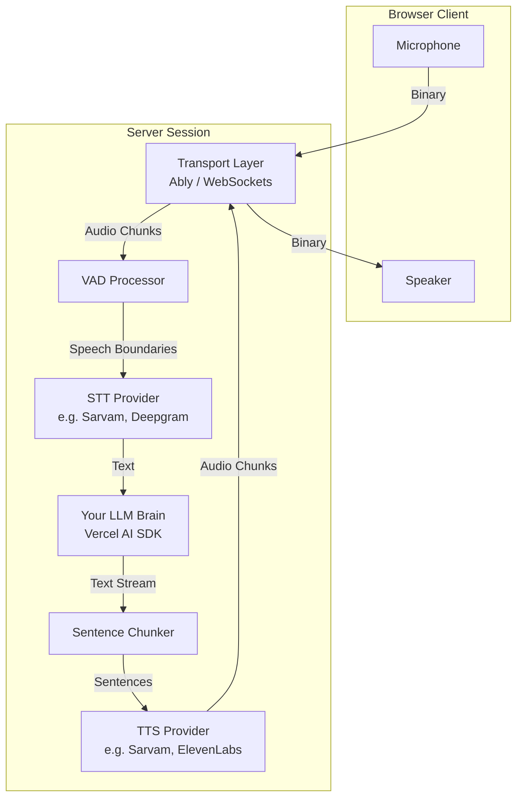

# voice-line

**Real-time voice layer for AI agents. You bring the brain — we handle the ears and mouth.**

> No WebRTC. No infrastructure. Just WebSockets.

`voice-line` is a TypeScript monorepo that sits between the microphone and the speaker. It handles audio capture, streaming, Voice Activity Detection (VAD), Speech-to-Text (STT), Text-to-Speech (TTS), playback, and intelligent interruptions. 

**It does not include an LLM.** The brain is yours. `voice-line` gives you transcribed text and expects text back.

Full architecture: [project.md](./project.md) · Agent rules: [AGENTS.md](./AGENTS.md)

---

## Architecture

`voice-line` is built on a stateless, transport-agnostic pipeline.



---

## ⚡️ Zero-Boilerplate Frontend (Vue & React)

Connecting a frontend to your AI agent shouldn't require hundreds of lines of boilerplate. `voice-line` ships with "Smart Hooks" for React and Vue that handle token fetching, transport instantiation, and state management in a single line.

### React

```tsx
import { useVoiceAgent } from '@voice-line/react'
import { createAblyClientSession } from '@voice-line/transport-ably'
import Ably from 'ably'

function VoiceChat() {
  const {
    state,           // 'idle' | 'connecting' | 'listening' | 'speaking'
    messages,        // Full conversation history
    isConnected,
    connect,
    disconnect,
    toggleMic
  } = useVoiceAgent({
    // Tell the hook how to fetch a token from your server:
    session: createAblyClientSession('/api/session', Ably.Realtime)
  })

  return (
    <div>
      <button onClick={connect}>Start Conversation</button>
      <button onClick={toggleMic}>Toggle Mic</button>
      <p>Status: {state}</p>
    </div>
  )
}
```

### Vue 3

```vue
<script setup lang="ts">
import { useVoiceAgent } from '@voice-line/vue'
import { createAblyClientSession } from '@voice-line/transport-ably'
import Ably from 'ably'

const { state, messages, connect, disconnect } = useVoiceAgent({
  session: createAblyClientSession('/api/session', Ably.Realtime)
})
</script>

<template>
  <button @click="connect">Start</button>
  <div>Status: {{ state }}</div>
</template>
```

---

## 🚀 Server Setup (Next.js / Nuxt)

`voice-line` gives you full control over the backend. You configure the transport, STT, TTS, and your custom LLM logic.

### Next.js App Router

```typescript
// app/api/session/route.ts
import { createRouteHandler } from '@voice-line/server/next'
import { ably } from '@voice-line/transport-ably'
import { sarvam } from '@voice-line/provider-sarvam'
import { fromAISDK } from '@voice-line/adapter-ai-sdk'
import { openai } from '@ai-sdk/openai'

export const POST = createRouteHandler({
  // 1. Choose your transport
  transport: ably({ apiKey: process.env.ABLY_API_KEY }),
  
  // 2. Choose your STT and TTS providers
  stt: sarvam.stt({ language: 'en-IN' }),
  tts: sarvam.tts({ voice: 'anushka' }),
  
  // 3. Connect your brain using Vercel AI SDK
  brain: fromAISDK({
    model: openai('gpt-4o-mini'),
    system: 'You are a helpful voice assistant.',
  }),
})
```

---

## Packages

Every package maps to exactly one domain concept. No messy cross-dependencies.

| Package | Role |
|---------|------|
| `@voice-line/core` | Domain: types, interfaces, Pipeline, Session, VAD, chunker |
| `@voice-line/server` | Server runtime, session manager, Next/Nitro handlers |
| `@voice-line/client` | Browser: mic, speaker, `VoiceLineClient` |
| `@voice-line/vue` | Vue 3 `useVoiceAgent` |
| `@voice-line/react` | React `useVoiceAgent` |
| `@voice-line/transport-ws` | Raw WebSocket transport |
| `@voice-line/transport-ably` | Ably transport |
| `@voice-line/provider-sarvam` | Sarvam STT (Saaras) + TTS (Bulbul) |
| `@voice-line/adapter-ai-sdk` | Vercel AI SDK → Brain |

---

## Stateless Processing

Don't need real-time WebSockets? `voice-line` supports stateless HTTP workloads for simple push-to-talk applications or standalone APIs.

```typescript
// Standalone TTS API (Nuxt Nitro)
import { createTTSHandler } from '@voice-line/server/nitro'
import { sarvam } from '@voice-line/provider-sarvam'

export default createTTSHandler({
  tts: sarvam.tts({ voice: 'shubh' })
})
```

---

## Developing

```bash
pnpm install
pnpm build
pnpm test
pnpm typecheck
```

Requirements: Node ≥ 20, pnpm 9.

## License

MIT
