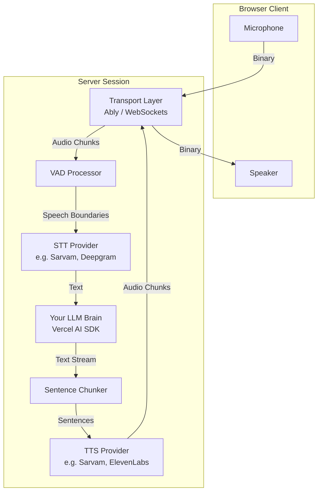

# What is voice-line?

`voice-line` is an open-source TypeScript framework that adds **real-time conversational voice to any AI agent**. It handles everything between the microphone and the speaker: audio capture, streaming, Voice Activity Detection (VAD), Speech-to-Text (STT), Text-to-Speech (TTS), audio playback, and most importantly—human interruptions.

**voice-line does not include an LLM.** The brain is yours. `voice-line` simply gives you transcribed text and expects text back. What happens in between—which model you call, what tools you run, what memory system you use—is entirely up to you.

## The Domain Model

`voice-line` is built around five core abstractions. Every package in the monorepo maps to exactly one of these concepts:

### 1. Session
A single voice conversation. Created when a user connects, destroyed when they disconnect. It owns the transport connection, the inbound and outbound pipelines, the message history, and the interruption state machine.

### 2. Transport
Moves binary audio chunks and JSON events between client and server. `voice-line` ships with adapters for Ably and raw WebSockets, but any bidirectional channel works. A transport only knows how to send and receive.

### 3. Pipeline
The ordered sequence of processors that transform data. 
- **Inbound:** Raw audio → VAD (detect speech boundaries) → STT (transcribe to text)
- **Outbound:** Text tokens → Sentence chunker → TTS (synthesize to audio) → Audio queue

### 4. Brain
The developer's LLM code. `voice-line` calls your brain with transcribed text and expects text back (either a string or a streaming async generator). 

### 5. Provider
A pluggable implementation of STT or TTS. Providers are stateless factories—they create streams (STT) or synthesize audio (TTS). 

## Interruption Handling (Barge-in)

When the session is speaking and the VAD detects user speech:
1. The outbound pipeline is flushed (TTS generation is aborted, queued audio is discarded).
2. The brain's async generator is cancelled.
3. The partial assistant message is saved to history with `partial: true`.
4. The client receives an `audio:flush` event and stops playback.
5. The inbound pipeline immediately processes the new user utterance.

This happens synchronously on the server in a single tick. There are no race conditions.
